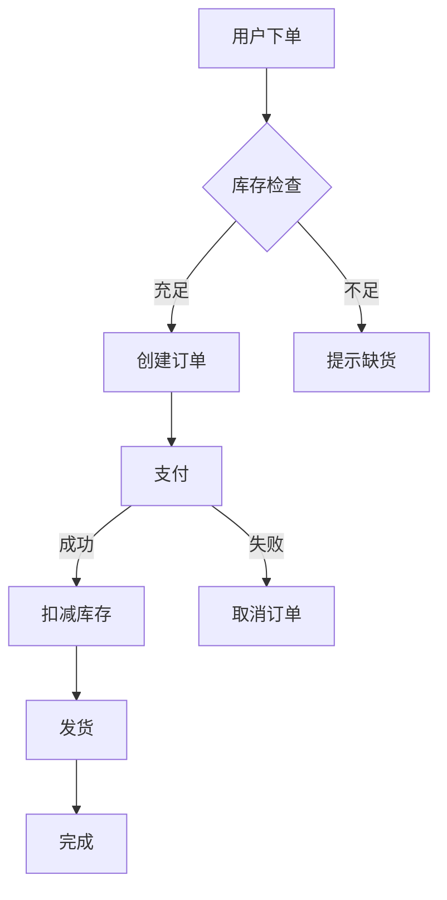
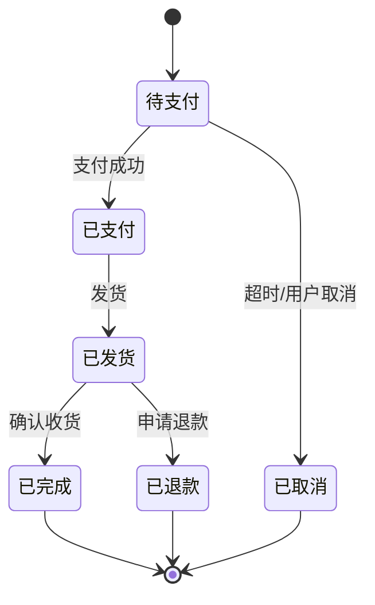
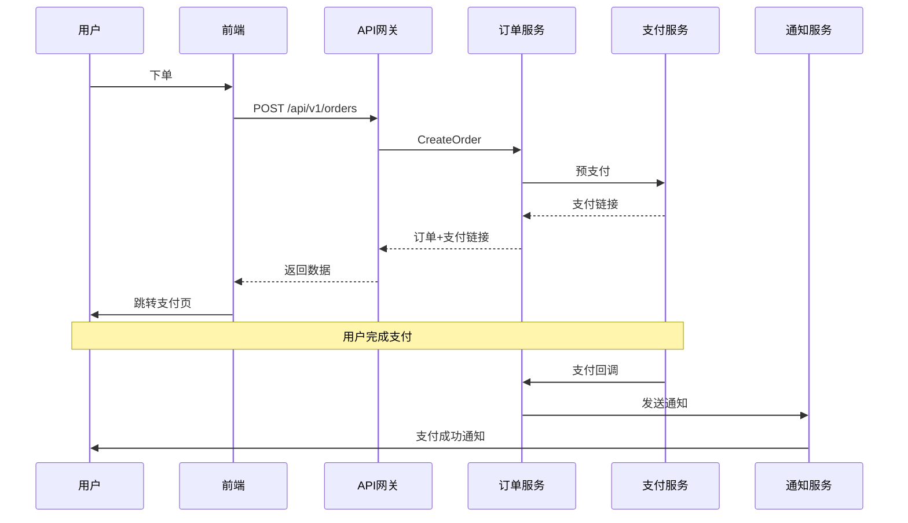
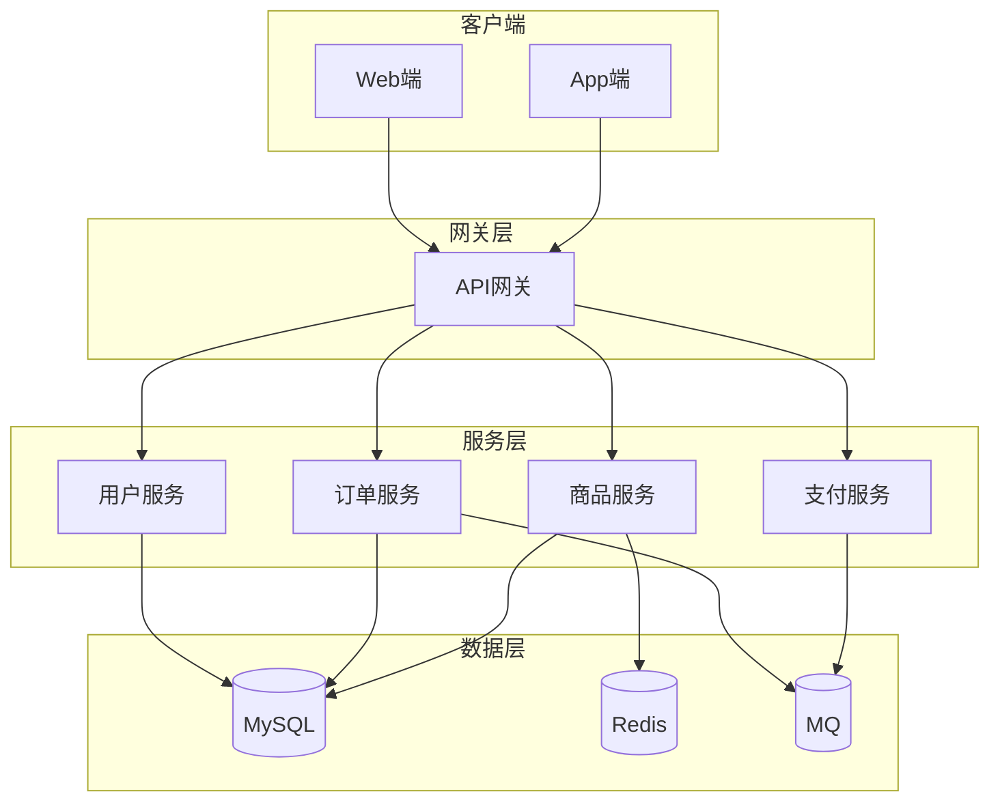
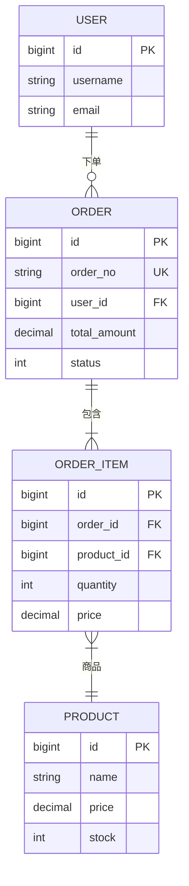

# 业务方案与技术设计

以**高级软件架构师**视角，提供从业务分析到技术落地的完整设计方案。

## 使用方式

| 需求类型 | 说明 |
|---------|------|
| **工程分析 + 方案设计** | 提供工程路径，分析现有设计后输出方案 |
| **业务方案设计** | 描述业务场景，输出完整方案文档 |
| **流程图设计** | 描述流程，输出 Mermaid 图表 |
| **接口与表设计** | 描述具体模块，输出 proto + SQL |

---

# 一、流程图设计

使用 Mermaid 语法输出各类图表，支持在 Markdown 中渲染。

## 图表类型

### 1. 业务流程图 (Flowchart)

展示业务操作流程、决策分支、并行处理。



**语法要点：**
- `TD/TB` - 从上到下，`LR` - 从左到右
- `[]` 矩形，`{}` 菱形(判断)，`(())` 圆形
- `-->` 连接线，`-->|文字|` 带文字连接

### 2. 状态机图 (State Diagram)

展示实体状态流转、触发条件。



### 3. 时序图 (Sequence Diagram)

展示系统间交互、API 调用顺序。



**语法要点：**
- `participant A as 别名` 定义参与者
- `->>` 实线箭头，`-->>` 虚线箭头
- `Note over A,B: 说明` 添加注释

### 4. 架构图 (Flowchart/C4)

展示系统架构、模块关系。



### 5. ER 图 (Entity Relationship)

展示数据实体关系。



---

# 二、工程分析

## 分析流程

当用户提供工程路径时，按以下步骤分析：

### 1. 目录结构分析

```bash
find . -type f -name "*.proto" | head -20
find . -type f -name "*.sql" | head -20
find . -type f -name "*.go" | head -30
```

分析要点：
- 项目分层结构
- 模块划分方式
- 命名规范

### 2. 接口风格分析

读取 proto 文件，提取命名风格。

### 3. 数据模型分析

读取 SQL 或实体定义，提取表结构规范。

### 4. 业务流程分析

读取 service 层代码，提取核心逻辑。

## 分析输出

```markdown
# 工程分析报告

## 1. 项目结构
[目录树]

## 2. 接口风格
[proto 规范]

## 3. 数据模型
[表结构规范]

## 4. 业务流程图
[Mermaid 流程图]

## 5. 设计建议
[基于现有风格的建议]
```

---

# 三、业务方案设计

## 设计流程

### 1. 需求分析
- 业务背景与目标
- 核心业务流程
- 关键业务实体
- 用户角色与权限

### 2. 架构设计
- 系统架构图
- 模块划分
- 技术选型

### 3. 详细设计
- 用例设计
- 状态机设计
- 接口契约
- 数据模型

### 4. 实施规划
- 迭代计划
- 风险评估

## 输出格式

```markdown
# 业务方案设计文档

## 1. 需求概述
### 1.1 业务背景
### 1.2 业务目标
### 1.3 范围边界

## 2. 业务分析
### 2.1 用户角色
### 2.2 核心业务流程图
[Mermaid 流程图]
### 2.3 业务规则

## 3. 架构设计
### 3.1 系统架构图
[Mermaid 架构图]
### 3.2 模块划分
### 3.3 技术选型

## 4. 详细设计
### 4.1 核心实体
### 4.2 状态流转图
[Mermaid 状态机图]
### 4.3 时序图
[Mermaid 时序图]
### 4.4 数据模型
[Mermaid ER图]

## 5. 实施规划
### 5.1 迭代计划
### 5.2 风险评估
```

---

# 四、接口与数据库设计

## 数据表设计原则

- 表名蛇形命名
- 主键 `id` BIGINT UNSIGNED
- 必备字段 `created_at`、`updated_at`
- 软删除 `deleted_at`
- 状态字段用 TINYINT

**建表模板：**
```sql
CREATE TABLE `table_name` (
    `id` BIGINT UNSIGNED NOT NULL AUTO_INCREMENT COMMENT '主键',
    `field_name` VARCHAR(255) NOT NULL DEFAULT '' COMMENT '字段说明',
    `status` TINYINT NOT NULL DEFAULT 0 COMMENT '状态: 0-禁用 1-启用',
    `created_at` DATETIME NOT NULL DEFAULT CURRENT_TIMESTAMP,
    `updated_at` DATETIME NOT NULL DEFAULT CURRENT_TIMESTAMP ON UPDATE CURRENT_TIMESTAMP,
    `deleted_at` DATETIME DEFAULT NULL,
    PRIMARY KEY (`id`),
    KEY `idx_field` (`field_name`)
) ENGINE=InnoDB DEFAULT CHARSET=utf8mb4 COMMENT='表说明';
```

## Proto 接口设计规范

- package: `api.{module}.v1`
- service: `{Module}Service`
- method: `Create{Entity}`、`Get{Entity}`、`List{Entities}`、`Update{Entity}`、`Delete{Entity}`
- message: `{Entity}Request`、`{Entity}Response`

---

## 参考资料

- [references/patterns.md](references/patterns.md) - 常见业务场景设计模式
- [references/architecture-patterns.md](references/architecture-patterns.md) - 架构设计模式
- [references/mermaid-guide.md](references/mermaid-guide.md) - Mermaid 图表语法速查
