# Mermaid 图表语法速查

## 1. 流程图 (Flowchart)

### 基本语法

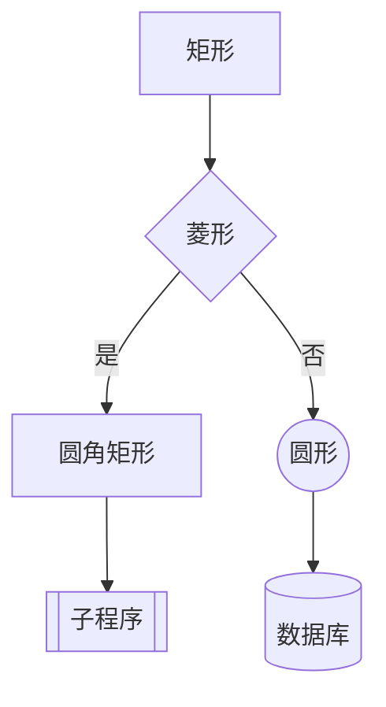

### 方向
- `TD` / `TB` - 从上到下
- `BT` - 从下到上
- `LR` - 从左到右
- `RL` - 从右到左

### 节点形状
| 语法 | 形状 |
|-----|------|
| `A[文字]` | 矩形 |
| `A(文字)` | 圆角矩形 |
| `A((文字))` | 圆形 |
| `A{文字}` | 菱形 |
| `A{{文字}}` | 六边形 |
| `A[[文字]]` | 子程序 |
| `A[(文字)]` | 数据库 |
| `A[(文字)]` | 圆柱 |

### 连接线
| 语法 | 样式 |
|-----|------|
| `-->` | 实线箭头 |
| `---` | 实线无箭头 |
| `-.->` | 虚线箭头 |
| `-.-` | 虚线无箭头 |
| `==>` | 粗线箭头 |
| `===` | 粗线无箭头 |
| `--文字-->` | 带文字 |

### 子图

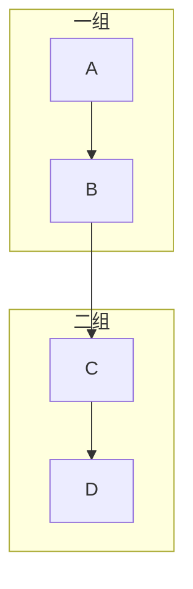

---

## 2. 状态图 (State Diagram)

### 基本语法

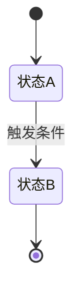

### 复合状态

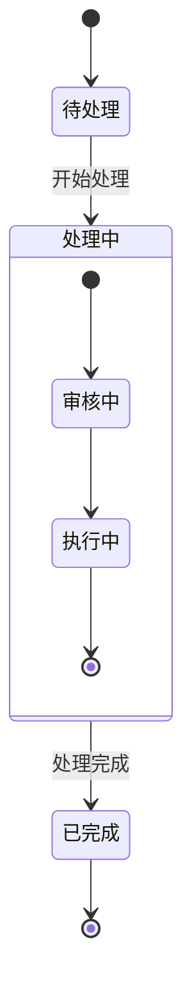

### 并行状态

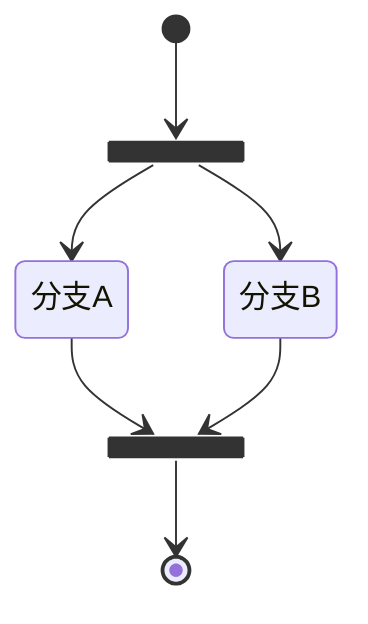

---

## 3. 时序图 (Sequence Diagram)

### 基本语法

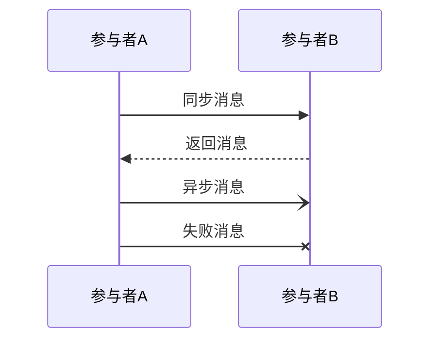

### 消息类型
| 语法 | 类型 |
|-----|------|
| `->>` | 实线箭头(同步) |
| `-->>` | 虚线箭头(返回) |
| `->>` | 实线开放箭头 |
| `--)` | 实线异步箭头 |
| `-x` | 实线叉号(失败) |

### 注释和框

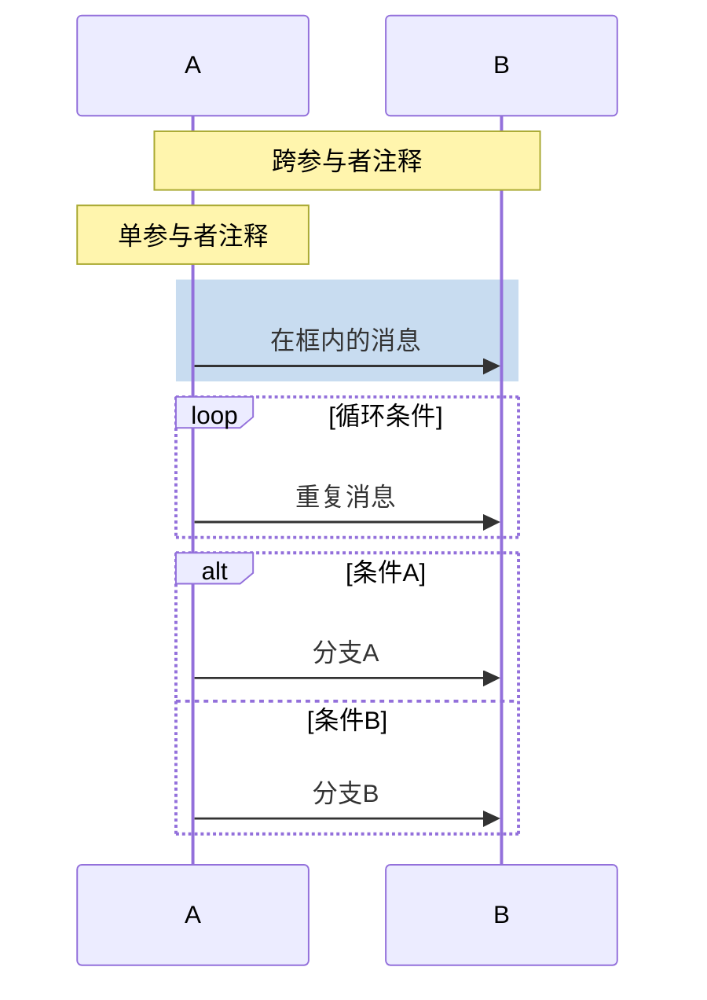

---

## 4. ER 图 (Entity Relationship)

### 基本语法

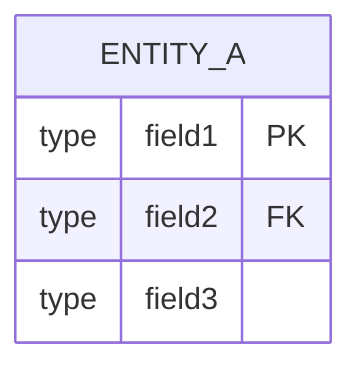

### 关系类型
| 语法 | 关系 |
|-----|------|
| `\|o--o\|` | 一对一 |
| `\|o--o{` | 一对多 |
| `}o--o{` | 多对多 |
| `\|\|--\|\|` | 必须关联 |

### 示例

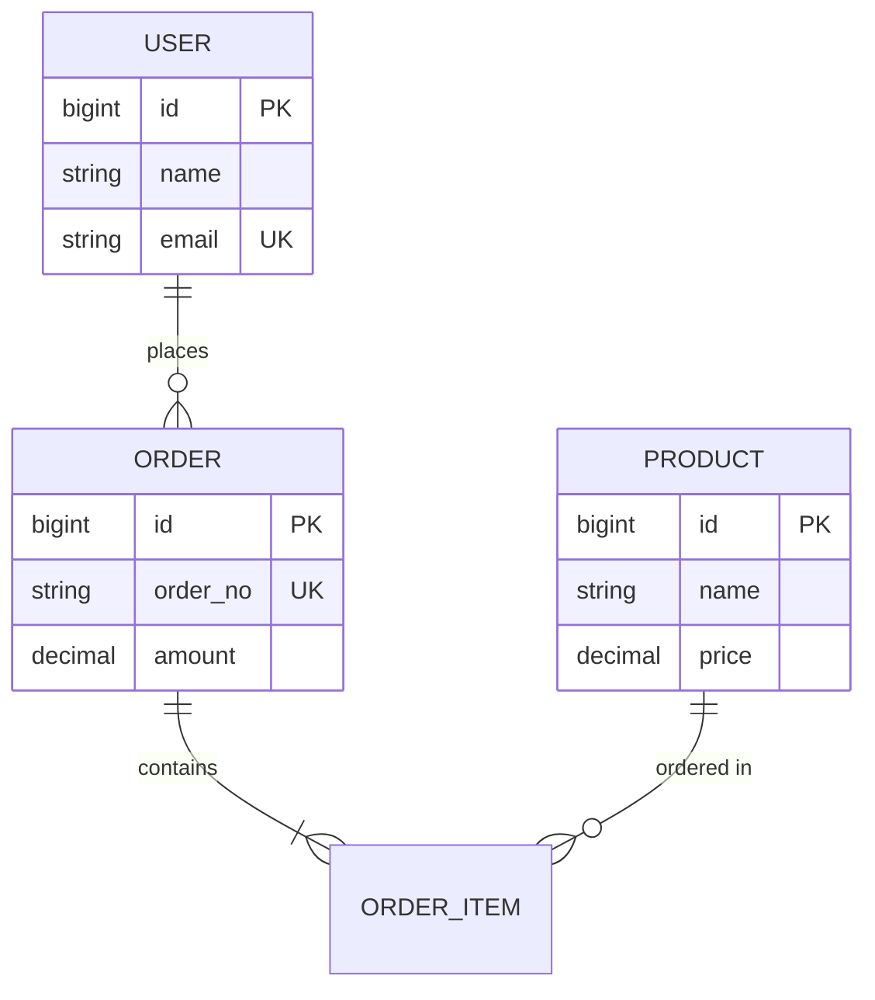

---

## 5. 类图 (Class Diagram)

### 基本语法

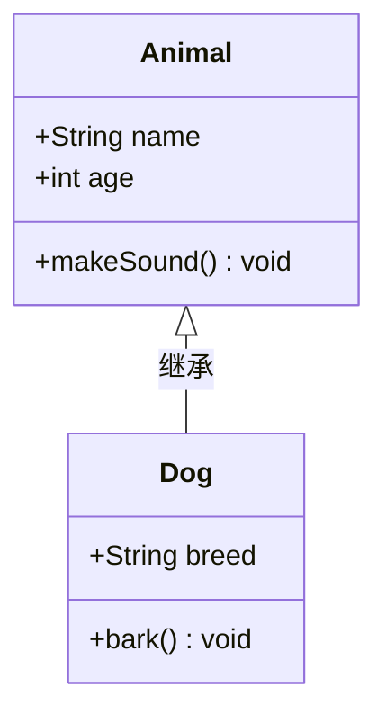

### 关系类型
| 语法 | 关系 |
|-----|------|
| `<\|--` | 继承 |
| `*--` | 组合 |
| `o--` | 聚合 |
| `-->` | 关联 |
| `--` | 链接 |
| `..>` | 依赖 |
| `..\|>` | 实现 |

### 可见性
| 符号 | 可见性 |
|-----|------|
| `+` | Public |
| `-` | Private |
| `#` | Protected |
| `~` | Package/Internal |

---

## 常用模板

### 订单流程

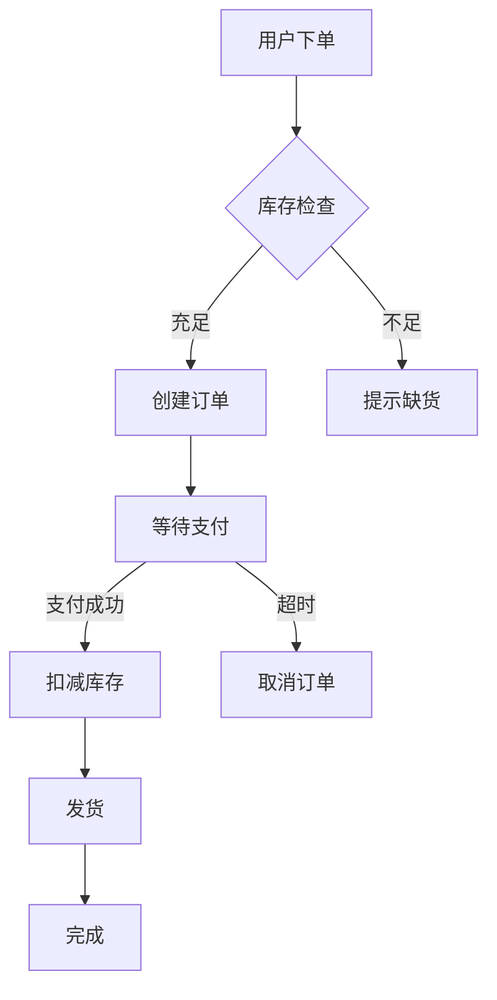

### 系统交互

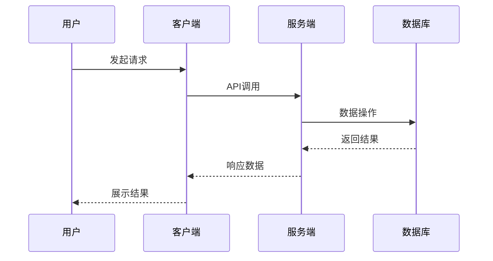

### 状态流转

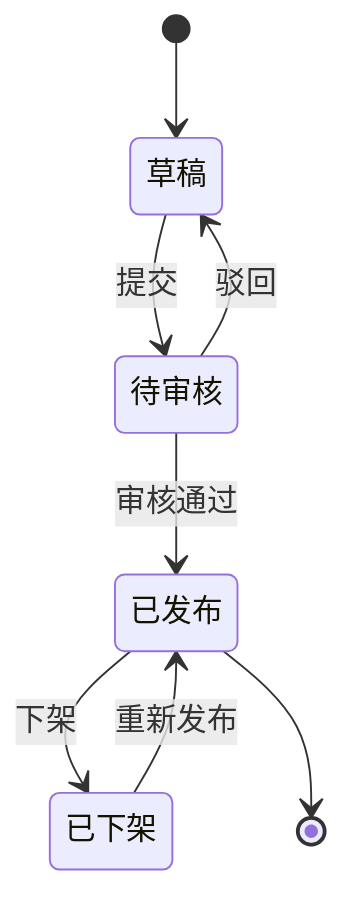
